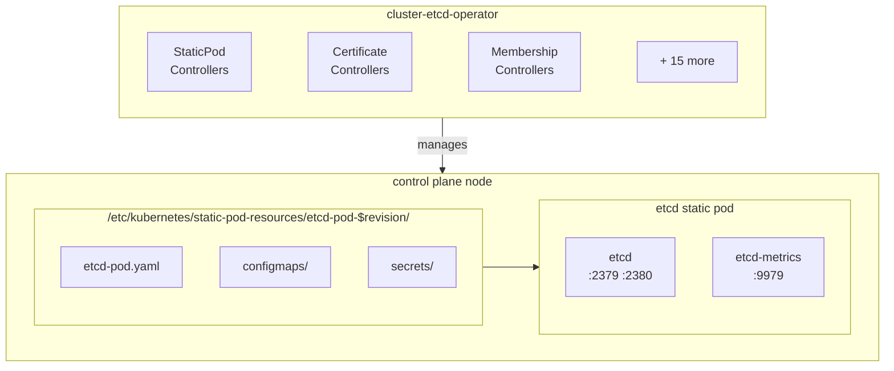

# Internal architecture and design decisions for cluster-etcd-operator.

## Overview

The cluster-etcd-operator (CEO) manages etcd as a static pod on OpenShift control plane nodes using the library-go StaticPodOperator framework. It runs ~20 concurrent controllers handling static pod lifecycle, TLS certificates, cluster membership, backups, and health monitoring.

## Controllers

All controllers are initialized in `pkg/operator/starter.go` `RunOperator()` and follow the library-go factory pattern. The following are the key architectural considerations for controllers in this operator:
- wrap sync logic with `health.NewDefaultCheckingSyncWrapper()` for liveness monitoring via a centralized `MultiAlivenessChecker`
    - Previously the operator would frequently deadlock, and was difficult to debug. This allows the operator to be restarted when it gets stuck so that it can continue processing.
- quorum safety first - we favor etcd availability ALWAYS and on any SKU, anything that causes downtime must be avoided at all costs
one concern per controller
- always use informers and cached clients, avoid directly hitting APIs and etcd, we want a low resource control plane footprint
- always refactor into reusable helpers and interfaces as building blocks
- verbose logging - debugging CI and customer cases is difficult, so aim to provide any relevant context in logs. Only use status conditions and events when you want to communicate actionable feedback to the admin or the CI timeline

### Cluster Membership Controllers

- **ClusterMemberController** (`pkg/operator/clustermembercontroller/clustermembercontroller.go`) — Scale-up: adds new control plane nodes as etcd learners (`MemberAddAsLearner`), promotes to voting members once deletion hooks are set and the member is healthy. Skips reconciliation if any existing members are unhealthy. In DualReplica topology with completed Pacemaker transition, defers to TNF/Pacemaker.

- **ClusterMemberRemovalController** (`pkg/operator/clustermemberremovalcontroller/clustermemberremovalcontroller.go`) — Scale-down: removes etcd members for machines pending deletion (one at a time, unhealthy first) after verifying quorum safety and revision rollout stability. Requires Machine API. Skips until bootstrap is complete.

- **BootstrapTeardownController** (`pkg/operator/bootstrapteardown/bootstrap_teardown_controller.go`) — Removes the temporary `etcd-bootstrap` member once enough healthy non-bootstrap members exist per the scaling strategy. Sets conditions: `EtcdRunningInCluster`, `EtcdBootstrapMemberRemoved`, `BootstrapTeardownDegraded`.

- **MachineDeletionHooksController** (`pkg/operator/machinedeletionhooks/machinedeletionhooks.go`) — Adds `PreDrain` lifecycle hooks to master machines so deletion blocks until a replacement etcd member is promoted. Removes hooks from machines pending deletion that no longer have a running etcd pod. Requires Machine API.

### Certificate Controllers

- **EtcdCertSignerController** (`pkg/operator/etcdcertsigner/etcdcertsignercontroller.go`) — Manages TLS certificate lifecycle. Maintains two CA hierarchies: `etcd-signer` (client/peer) and `etcd-metric-signer` (metrics). Generates per-node leaf certs, aggregates into `etcd-all-certs` Secret and `etcd-all-bundles` ConfigMap. Implements two-phase rotation (4.17+): bundles update in revision N, leaf certs regenerate in N+1, gated by `openshift.io/ceo-bundle-rollout-revision` annotation. Exports `openshift_etcd_operator_signer_expiration_days` metric.

- **EtcdCertCleanerController** (`pkg/operator/etcdcertcleaner/etcd_cert_cleaner_controller.go`) — Garbage-collects per-node TLS secrets for removed nodes. Tags unused secrets with a 72-hour grace period, then deletes.

### Configuration Controllers

- **TargetConfigController** (`pkg/operator/targetconfigcontroller/targetconfigcontroller.go`) — Generates the `etcd-pod` ConfigMap containing the rendered static pod manifest. Reads templates from bindata and renders with cluster topology, network, infrastructure, and environment variable data. Changes trigger new revisions. Listens to `EnvVarController` for env var changes.

- **ConfigObserver** (`pkg/operator/configobservation/configobservercontroller/observe_config_controller.go`) — Wraps library-go's `ConfigObserver` to watch cluster configuration (APIServers, Networks, Infrastructure) and write observed values into `Spec.ObservedConfig`. Runs `ObserveTLSSecurityProfile` (library-go) and `ObserveControlPlaneReplicas` (custom, from nodes and install-config).

- **EnvVarController** (`pkg/etcdenvvar/envvarcontroller.go`) — Computes etcd process environment variables from nodes, endpoints, infrastructure, networks, and the Etcds CR. Uses a listener pattern to notify `TargetConfigController` and `ScriptController` on changes.

- **ScriptController** (`pkg/operator/scriptcontroller/scriptcontroller.go`) — Maintains the `etcd-scripts` ConfigMap with shell scripts from bindata (backup, restore, quorum restore, etc.). Re-syncs on `EnvVarController` changes. Copied to each node as an unrevisioned resource by InstallerController.

### Endpoints and Health Controllers

- **EtcdEndpointsController** (`pkg/operator/etcdendpointscontroller/etcdendpointscontroller.go`) — **Critical:** Maintains the `etcd-endpoints` ConfigMap with current member IP addresses. **Must never depend on DNS** (circular bootstrap dependency). Falls back to node IPs when etcd member list is unavailable. Changes trigger new revisions.

- **EtcdMembersController** (`pkg/operator/etcdmemberscontroller/etcdmemberscontroller.go`) — Reports etcd member health as operator status conditions: `EtcdMembersDegraded` (unhealthy members), `EtcdMembersProgressing` (unstarted members), `EtcdMembersAvailable` (quorum check). For DualReplica with completed Pacemaker transition, always reports quorum as available.

- **FSyncController** (`pkg/operator/metriccontroller/fsync_controller.go`) — Monitors etcd I/O by querying Prometheus. Detects excessive leader changes (>= 2 in 5 minutes), then checks WAL fsync durations. Sets `FSyncControllerDegraded` if any member's p99 WAL fsync exceeds 3 seconds.

- **DefragController** (`pkg/operator/defragcontroller/defragcontroller.go`) — Rolling online defragmentation. Syncs every 10 minutes (etcd compaction interval). Defrags when fragmentation > 45% and DB > 100MB, one member at a time (leader last). Disabled via `etcd-disable-defrag` ConfigMap. Only for HA, DualReplica, and HA-Arbiter topologies. Sets `DefragControllerDegraded` after 3 consecutive failures.

### Resource Management Controllers

- **EtcdStaticResources** (library-go `StaticResourceController`, instantiated in `pkg/operator/starter.go`) — Applies static YAML resources from bindata: namespace, ServiceAccount, Service, ServiceMonitors, Prometheus RBAC, backup RBAC, and NetworkPolicies for `openshift-etcd`.

- **ResourceSyncController** (`pkg/operator/resourcesynccontroller/resourcesynccontroller.go`) — Syncs ConfigMaps and Secrets between namespaces. Copies `cluster-config-v1` from `kube-system` to `openshift-etcd`. Conditionally syncs CA bundles and client certs from `openshift-etcd` to `openshift-etcd-operator` and `openshift-config`, with precondition checks to avoid deleting destination resources during transitions.

### Static Pod Lifecycle Controllers (library-go)

These are instantiated via `staticpod.NewBuilder()` in `pkg/operator/starter.go` and manage the static pod revision lifecycle:

- **RevisionController** — Watches the `etcd-pod`, `etcd-endpoints`, `etcd-all-bundles` ConfigMaps and `etcd-all-certs` Secret. When any change, creates a new numbered revision (copies resources with a `-N` suffix). Gated by a quorum safety precondition (`QuorumChecker.IsSafeToUpdateRevision()`) to prevent rolling out changes when the cluster is unhealthy.

- **InstallerController** — Rolls out static pod revisions to each control plane node. Launches installer pods that write revision resources to `/etc/kubernetes/static-pod-resources/etcd-pod-N/` and update `/etc/kubernetes/manifests/etcd-pod.yaml`. Also copies unrevisioned resources (scripts, certs, bundles, restore pod template) to a fixed location on each node.

- **PruneController** — Garbage-collects old static pod revisions, retaining the last 5 successful and 5 failed revisions to bound disk usage.

- **GuardController** — Maintains a PodDisruptionBudget to prevent simultaneous etcd pod eviction during node drain. Uses `IfHealthyBudget` policy (eviction blocked when pods not ready). Only for multi-node topologies after the operator reaches its desired version.

### Operator Status Controllers (library-go)

- **StatusSyncer** (instantiated in `pkg/operator/starter.go` as `StatusSyncer_etcd`) — Aggregates operator status conditions and reports them on the `ClusterOperator/etcd` resource. Tracks `Available`, `Progressing`, `Degraded`, and `Upgradeable` conditions. Uses degraded inertia (10-minute duration) to prevent flapping.

- **UnsupportedConfigOverridesController** (instantiated in `pkg/operator/starter.go`) — Watches for unsupported config overrides in `Operator.Spec.UnsupportedConfigOverrides` and sets `UnsupportedConfigOverridesDegraded` if any are present.

### Backup Controllers (feature-gated)

These controllers are only started when the `AutomatedEtcdBackup` feature gate is enabled:

- **PeriodicBackupController** (`pkg/operator/periodicbackupcontroller/periodicbackupcontroller.go`) — Watches `Backup` CRs (config.openshift.io/v1alpha1) and reconciles CronJobs to trigger scheduled backups.

- **BackupController** (`pkg/operator/backupcontroller/backupcontroller.go`) — Watches `EtcdBackup` CRs (operator.openshift.io/v1alpha1) and creates Jobs for on-demand backups. Enforces serial execution — only one backup job at a time. Reconciles job status back to the CR.

- **BackupRemovalController** (`pkg/operator/backupcontroller/backup_removal_controller.go`) — Garbage-collects orphaned `EtcdBackup` CRs whose owning Jobs no longer exist (needed because EtcdBackups are cluster-scoped while Jobs are namespaced).

### Two-Node Fencing Controllers (topology-gated)

Started only for DualReplica topology clusters (Two-Node OpenShift with Fencing), initialized via `tnf.HandleDualReplicaClusters()` in `pkg/operator/starter.go`:

- **ExternalEtcdEnablerController** (`pkg/operator/externaletcdsupportcontroller/external_etcd_support_controller.go`) — Generates the `external-etcd-pod` ConfigMap with a static pod manifest for running etcd under Pacemaker management. Listens to `EnvVarController` for env var changes.

- **TnfStaticResources** (library-go `StaticResourceController`, instantiated in `pkg/tnf/operator/starter.go`) — Applies TNF static resources from bindata: ServiceAccount, Roles, ClusterRoles, RoleBindings, and the PacemakerCluster CRD.

- **PacemakerHealthCheck** (`pkg/tnf/pkg/pacemaker/healthcheck.go`, instantiated in `pkg/tnf/operator/starter.go`) — Monitors the PacemakerCluster CR for health status. Only starts after external etcd transition is complete.

- **PacemakerStatusCollectorCronJob** (`CronJobController` from `pkg/tnf/pkg/jobs/cronjob_controller.go`) — Runs `tnf-monitor collect` every minute to update the PacemakerCluster CR with Pacemaker state.

See `pkg/operator/starter.go` `RunOperator()` for the full initialization order and wiring.

## Key Design Decisions

### DNS Independence for EtcdEndpointsController

**Decision:** The EtcdEndpointsController must never depend on DNS, directly or transitively.

**Rationale:** This controller maintains `etcd-endpoints` ConfigMap in the `openshift-etcd` namespace with IP addresses that DNS resolution depends on. A DNS dependency would create a circular bootstrap problem.

**Tradeoff:** Controllers must use IP-based etcd client connections during bootstrap; cannot rely on service DNS names.

### Separate Signer CAs for Client and Metrics

**Decision:** Two independent CA signers: `etcd-signer` (client/peer) and `etcd-metric-signer` (metrics).

**Rationale:**
- Limits blast radius if metrics CA is compromised
- Allows independent rotation schedules
- Aligns with least-privilege principle

**Tradeoff:** More complex certificate topology; two rotation workflows.

**Since:** 4.4

### Two-Phase Certificate Rotation (4.17+)

**Decision:** Bundle updates happen in revision N; leaf cert regeneration waits for revision N+1.

**Rationale:** etcd rejects TLS from certs signed by unknown CAs. Simultaneous bundle+leaf updates cause TLS failures when a peer starts with new certs before other peers have the new CA bundle.

**Tradeoff:** 2 revision cycles instead of 1; gated by `openshift-etcd/etcd-all-bundles` annotation `openshift.io/ceo-bundle-rollout-revision`.

**Exceptions:** Skipped during bootstrap and vertical scaling.

See `docs/etcd-tls-assets.md` for detailed flow.

### Cached vs Uncached etcd Client

**Decision:** 60s cache for 3+ nodes; uncached for 2-node topologies.

**Rationale:** In 2-node, cache TTL masks failures—QuorumChecker sees "2 healthy" from cache while one is down, allowing unsafe revisions.

See `pkg/operator/starter.go` `RunOperator()` where `quorumMemberClient` is configured.

### Aggregated Secrets and ConfigMaps

**Decision:** `etcd-all-certs` Secret aggregates all per-node certs; `etcd-all-bundles` ConfigMap aggregates CA bundles.

**Rationale:** Atomic rollouts (one resource change = one revision); reduces watch overhead.

**Tradeoff:** Can't rotate single node cert without rolling all nodes.

**Since:** 4.16 (all-certs), 4.17 (all-bundles)

## Bootstrap Process

Bootstrap provisions the first etcd member before the API server exists:

1. `cluster-etcd-operator render` generates bootstrap certs and static pod manifest
2. `kube-etcd-signer-server` (kubecsr) acts as temporary CSR signer
3. kubelet launches bootstrap etcd pod
4. CVO installs CEO
5. `BootstrapTeardownController` removes bootstrap member once enough healthy non-bootstrap members exist (count varies by scaling strategy)

Controllers skip safety checks during bootstrap (e.g., cert rotation gating, quorum requirements).

See `docs/etcd-tls-assets.md`.

## Certificate Architecture

Two-tier PKI with separate CAs for client/peer (`etcd-signer`, 5y) and metrics (`etcd-metric-signer`, 5y). Leaf certs valid 3y, auto-rotate at ~2.2y.

**Source of truth:** `openshift-etcd` namespace. ResourceSyncController copies to `openshift-config` (kube-apiserver) and `openshift-etcd-operator` (CEO).

See `docs/etcd-tls-assets.md`.

## Static Pod Revision Mechanics

Revisions roll out config changes. RevisionController watches `etcd-pod`, `etcd-endpoints`, `etcd-all-bundles` (ConfigMaps) and `etcd-all-certs` (Secret). See `RevisionConfigMaps` and `RevisionSecrets` in `pkg/operator/starter.go`. On change:

1. RevisionController creates revision N (copies resources with -N suffix)
2. InstallerController launches installer pod on each node
3. Installer writes to `/etc/kubernetes/static-pod-resources/etcd-pod-N/` and `/etc/kubernetes/manifests/etcd-pod.yaml`
4. kubelet restarts etcd static pod
5. PrunerController retains last 5 successful + 5 failed

**Safety:** QuorumChecker blocks revisions if quorum unhealthy; bundle-rollout gating (4.17+) prevents cert updates before CA bundle rollout completes.

## etcd Client Abstraction

CEO's etcd client (`pkg/etcdcli/interfaces.go`) composes 10+ interfaces (MemberAdder, MemberRemover, Defragment, etc.). Two implementations:

- **etcdcli.EtcdClient** - Direct client using TLS certs
- **etcdcli.MemberCache** - Caching wrapper (60s TTL); not used for 2-node quorum checks

**Connection fallback:** IP-based `openshift-etcd/etcd-endpoints` ConfigMap → direct control plane node IPs.

## Deployment & Infrastructure

### Operator Deployment

**Namespace:** `openshift-etcd-operator`

**Deployment:** Single-replica Deployment (strategy: Recreate) managed by CVO.

**Resources:** 50Mi memory / 10m CPU requests (no limits).

**Security:**
- `priorityClassName: system-cluster-critical`
- Non-root user (UID 1000), read-only root filesystem
- All capabilities dropped, no privilege escalation
- Seccomp: RuntimeDefault

**Scheduling:**
- Tolerates master/control-plane node taints
- Management workload tier (PreferredDuringScheduling)

### etcd Static Pods

**Namespace:** `openshift-etcd` (target namespace for all etcd resources).

**Deployment:** One static pod per control plane node, managed by kubelet reading `/etc/kubernetes/manifests/etcd-pod.yaml`.

**Containers:**
- `etcd` - Main etcd process (ports 2379, 2380)
- `etcd-metrics` - Metrics proxy (port 9979)
- `etcd-readyz` - Readiness probe endpoint
- Init containers for env var setup and resource copy

**Resources:** ~50-60Mi memory / 5-10m CPU per container (requests only).

**Lifecycle:** RevisionController + InstallerController pattern - revisions stored in `/etc/kubernetes/static-pod-resources/etcd-pod-$N/`, pruner retains last 5 successful + 5 failed.

### Platform Requirements

**Control Plane Nodes:**
- Master node toleration required (operator schedules to control plane)
- Persistent storage for etcd data (`/var/lib/etcd/`)
- TLS PKI managed by operator (5y CA, 3y leaf certs)

**Network:**
- etcd peer communication: TCP 2380
- etcd client API: TCP 2379
- Metrics: TCP 9979
- Operator metrics: TCP 8443

**External Dependencies:**
- Machine API (for node metadata, optional)
- DNS (for service discovery; IP fallback available)
- CVO (for operator lifecycle)

### Upgrade Compatibility

**N-1 Skew:** Operator version must support etcd members from prior release (static pod revisions may lag during rolling upgrades).

**Breaking Changes:** If a controller is removed (extremely rare — human decision only), its status condition names must be added to `staleconditions.NewRemoveStaleConditionsController` in `pkg/operator/starter.go` for at least 1 release to prevent stale conditions from blocking upgrades.

**CVO Resource Removal:** Use `release.openshift.io/delete: "true"` annotation, not file deletion (see [AGENTS.md CVO Resource Removal](AGENTS.md#cvo-resource-removal)).

## Testing

### Unit Tests

**Mock Strategy:**
- **Fake etcd client** (`pkg/etcdcli/helpers.go`): `NewFakeEtcdClient()` with configurable member state, health, and error injection
- **Fake StaticPodOperatorClient** (library-go): `v1helpers.NewFakeStaticPodOperatorClient()` for operator CR interactions
- **Fake Kubernetes clients**: Standard `fake.NewSimpleClientset()` combined with informers

**Pattern:** Controllers tested by invoking `sync()` directly with fakes; assert on status conditions and resource mutations.

### E2E Tests (OTE Framework)

**Binary:** `cluster-etcd-operator-tests-ext` registers tests with [OpenShift Tests Extension](https://github.com/openshift-eng/openshift-tests-extension).

**Suites:**
- `openshift/cluster-etcd-operator/operator/disruptive` - `[Serial] [Disruptive]` tests (scaling, member ops, network partitions)
- `openshift/cluster-etcd-operator/operator/parallel` - Non-serial tests (verification, backup, health checks)

**Key Categories:** ClusterOperator status validation, backup/restore, scaling, quorum guard, network policies.

**Constraints:** Serial execution required (shared cluster state); 2h timeout; cluster-invasive.

See [AGENTS.md](AGENTS.md#ote-test-framework) for commands.

## References

- [CEO Overview](docs/overview/overview.md)
- [Certificate Topology](docs/etcd-tls-assets.md)
- [Quorum Guard Design](docs/etcd-quorum-guard.md)
- [Initial Cluster Discovery](docs/discover-initial-cluster.md)
- [library-go StaticPodOperator](https://github.com/openshift/library-go/blob/master/pkg/operator/staticpod/controllers.go)
- [etcd Operations Guide](https://etcd.io/docs/v3.5/op-guide/)
- [OpenShift etcd Documentation](https://docs.openshift.com/container-platform/latest/security/certificate_types_descriptions/etcd-certificates.html)
