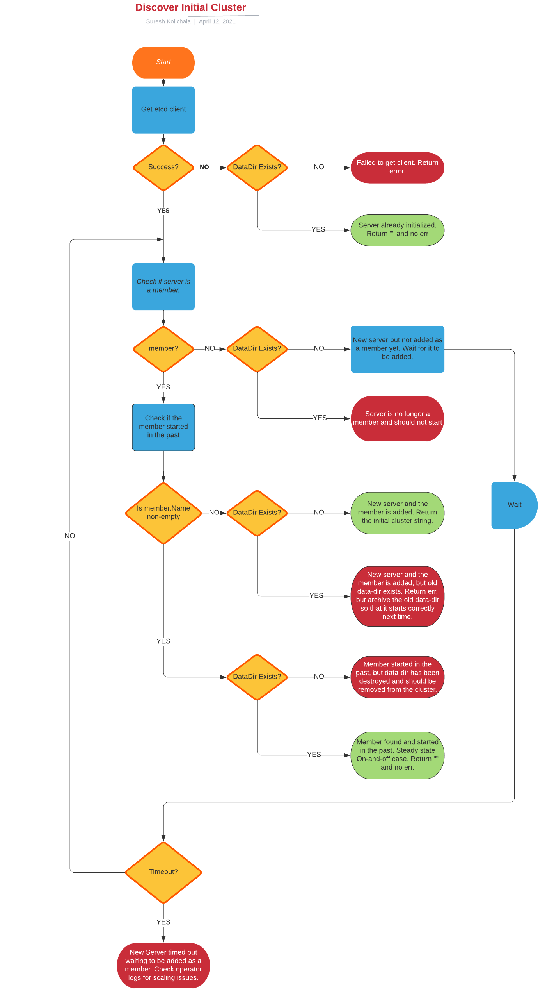

# Discover Initial Cluster

When a new master node is added to the cluster, cluster-etcd-operator (CEO) detects
the new node and adds a new member to the etcd member corresponding to the new node. 

When the etcd container starts up on a new member, it needs the details of the other
members so that it can connect with its peers and become part of the cluster.

This document describes how the initial cluster is discovered using a stand-alone
process known as `discover-init-cluster`.

# Background

As we create new etcd cluster members, we can use an offline bootstrap configuration 
to inform about the peer members by setting the `initial-cluster` flag. 

```
ETCD_INITIAL_CLUSTER="infra0=http://10.0.1.10:2380,infra1=http://10.0.1.11:2380,infra2=http://10.0.1.12:2380"
ETCD_INITIAL_CLUSTER_STATE=new
```
To understand more about the initial cluster variable, please see:
[etcd operations guide documentation](https://etcd.io/docs/v3.4/op-guide/clustering/).


# Implementation
## Souce Code
The source code for the implementation of the stand-along process `discover-init-cluster` is available
in openshift-tools directory of the [openshift/etcd repo](https://github.com/openshift/etcd/) for each of the release branches.

For example, the implementation for the openshift-4.8 release is found here:
[discover-init-cluster](https://github.com/openshift/etcd/blob/openshift-4.8/openshift-tools/pkg/discover-etcd-initial-cluster/initial-cluster.go)
## Flow Chart
The logic for discovering the initial cluster can be depicted as shown in the flow chart below. 



This image is created using lucid.app, and the source for generating this image is found here:
[discover-init-cluster-logic](https://lucid.app/lucidchart/invitations/accept/inv_df0d2c1d-e237-42b6-8101-70a5d5d43987)

